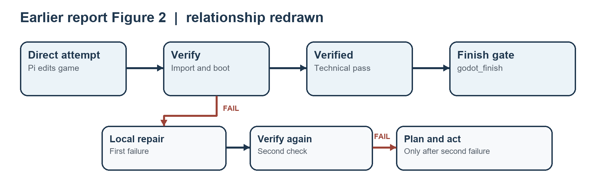
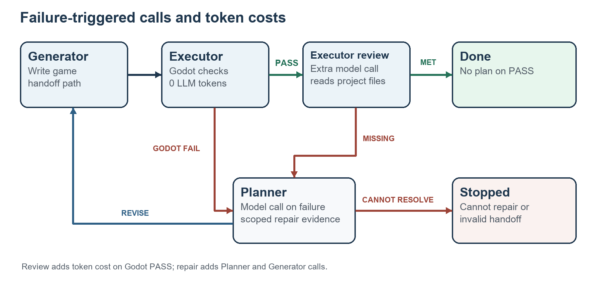

# LTGD 项目 AI 辅助使用报告

编码、报告写作与框架图制作记录 | 2026 年 9 月 30 日

## 1 使用范围

本项目把 Pi 对话作为游戏需求入口。Low-Token Game Development（LTGD）以减少生成游戏时的模型用量为目标：Generator 负责写 Godot 工程，Executor 自动执行引擎检查并发起需求审查，Planner 只在查出具体问题后给出修复步骤。Requirement Review 是 Executor 调用的模型审查阶段，不是第四个独立 Agent。编写本次报告时，我使用 Codex 阅读源码、旧报告、历史会话和 PaT 论文，重写英文报告的论证，核对用量，再用 Python 绘制框架图和排版 DOCX。绘图使用确定的形状与箭头，没有使用图像生成模型。

## 2 AI 如何辅助编码

Generator 从用户的自然语言直接编写场景和脚本，最后交出真实工程路径。Executor 在 `agent_before_settle` 事件中读取该路径，运行结构、导入和无头启动检查；这一步不调用语言模型。Godot 通过后，Executor 再发起一次独立模型请求，对照原始需求、任务文件和项目源码，返回 `implemented` 或 `missing`。若检查确认失败，Planner 根据错误和相邻源码输出 JSON 修复步骤，再交给 Generator 修改。源码见 `LTGDAgentSystem/godot-pat/index.ts`、`godot.ts`、`executor.ts` 和 `planner.ts`。

### 2.1 三个角色怎样接力

Generator 是 Pi 原生编码 Agent。首次收到需求时，它直接在用户指定目录（未指定时为 Pi 当前目录的 `game/`）制作工程，不先开一轮正式规划；结束时用 `<ltgd-project-path>` 交出实际路径。修复轮收到的只是已确认的问题和 Planner 的短步骤，提示词要求它只改这些问题。这种安排把长对话和文件编辑留在 Generator 一侧。

Executor 是自动检查环节。Generator 结束本轮后，扩展的 `agent_before_settle` 钩子绑定其交接路径，要求该目录有 `project.godot`，再检查主场景、Godot 导入和无头启动。通过后，它用独立模型请求对照原始需求、任务文件和工程源码；工程指纹用于防止审查期间文件变化后仍沿用旧的 Godot PASS。只有引擎检查通过且需求审查返回 `implemented`，状态才到 `done`。引擎失败或审查发现具体缺项时，Executor 把证据送往 Planner。需求审查读取的源码最多可达 240,000 字符，因此虽然它不继承 Generator 的完整对话，仍可能带来可观的输入 Token。

Planner 不写游戏代码。Godot 报错时，它收到最新错误及相关源码片段；需求审查报缺项时，它收到缺项证据和工程概览。它只返回针对该问题的 JSON 修复步骤，或说明无法根据工程证据修复。随后 Generator 按步骤修改，Executor 再验。这样，规划发生在已观察到失败之后，且 Planner 无需读完 Generator 的整段对话。

测试中的一条交接路径很直观：主场景缺失使 Godot 检查失败；Planner 要求补场景。补完后 Godot 通过，但模拟的需求审查指出“信号扫描交互缺失”；Planner 再给出修复步骤。Generator 写入 `Game.gd` 后，下一轮检查与模拟审查通过，任务进入 `done`。这条测试证明状态能按预期流转，不能代替对扫描玩法的真人试玩。

这次没有把 AI 返回的“完成”当作测试结论。我运行了仓库的 12 项系统实现测试，结果为 12 通过、0 失败；其中包含真实 Godot 导入与启动。另将 `output/game/` 的六份历史目录复制到临时目录后重查：五份通过导入和无头启动，`MAG_direct` 缺少 `project.godot`。这个结果只说明技术启动情况，不说明游戏玩法已经符合任务书。历史用量部分分别列出调用次数、非缓存输入、缓存读取、输出、总 Token 和估算费用；三个任务中 LTGD 记录均较低，但这些会话早于当前实现，每个条件也只有一次记录，不能写成当前版本已证明的节省率。

## 3 AI 如何辅助写作与作图

英文报告的初稿依据 README、扩展源码、测试、历史 DOCX 和用量导出生成。我逐段核对“谁触发下一步”“检查的是哪个目录”“通过的含义”以及每个数字的来源。旧 DOCX 写的是手动 `godot_verify`、先局部修复再规划、`godot_finish` 完成；当前代码已改成结束轮次后自动检查、首次确认失败即调用 Planner、独立需求审查后才完成。随后参考 Yoon 等的 PaT 论文，将英文报告的主线改成“直接尝试—执行反馈—失败后规划—成本与完成度共同评价”。借用的是论证顺序和规划时机，没有把论文的 Best-of-N、递归分解、异构模型实验或成本数字写成 LTGD 已实现的内容。

框架图用 Python 绘制，先列节点，再为每条箭头写触发条件。图 1 区分 Pi、Generator、Executor、Planner 与 Godot；图 2 把 `Executor review` 明确标为 Executor 的阶段，并在 Godot 检查处标“0 LLM tokens”、在审查和 Planner 处标出额外模型调用。英文报告的图注限定了图的证据范围：`done` 需要 Godot PASS 和需求审查通过，但图不能证明游戏可玩。新增的图 3 从六份 `usage.json` 读取 Total Tokens，以每个游戏的 Baseline 与 LTGD 两根柱子显示差距；柱顶标出总量，游戏名下标出相对 Baseline 的节约率。

## 4 发现的问题与修改前后对比

| 检查对象 | 修改前 | 修改后 | 修改原因 |
| --- | --- | --- | --- |
| 英文方法叙述 | 旧报告：“On the first technical failure, the controller enters repair ... A second failed verification moves to plan.” | 新报告：“Any confirmed Godot failure or concrete missing requirement moves the task to `plan`.” | `controller.ts` 的 `recordVerification` 在首次失败后即设为 `plan`；旧句已与代码不符。 |
| 完成条件 | 旧图使用 “Verified → Finish gate / godot_finish to done”。 | 新图使用 “Godot PASS → Requirement review → done”，`missing` 返回 Planner。 | 当前实现没有 `godot_finish` 工具；需求审查是独立模型请求。 |
| 初稿中的套话 | “本系统并不是盲目生成游戏，而是通过多角色闭环确保质量。” | “Generator 写入工程后，Executor 自动导入并启动 Godot；需求审查另行检查原始要求。两项通过才记为 `done`。” | 初稿用否定式解释和“确保质量”掩盖了检查边界。修订句交代动作与完成条件。 |
| 结果表述 | “LTGD 显著降低 Token 消耗并提高游戏质量。” | “三组历史 LTGD 会话的记录总量较低；当前资料不能证明这种差异由扩展造成，也没有共同的玩法评分。” | 每组只有一次旧版本会话，缺少相同评价标准，不能做因果或质量判断。 |
| token 指标与表图 | 初稿重复列游戏名，六行数值难以按游戏对照；只看 Total Tokens 还会掩盖缓存读取与费用的区别。 | 英文表 1 每个游戏占一行，Baseline 与 LTGD 分列，保留 Calls、Input、Cache read、Output、Total 和 Cost；末列给出总 Token 节约率。图 3 用成对柱子呈现总量差距。 | 按游戏配对更容易核对；题注写明计算式、缓存写入为零及单次历史会话的范围。 |
| 角色与图 | 图 2 把 Review 画成与 Executor 并列的框，容易被读成第四个 Agent。 | 框名改为 “Executor review”，标明它增加一次模型调用。 | `executor.ts` 定义审查，`index.ts` 在 Executor 流程中发起模型请求。 |
| 论文类比 | “采用 PaT，所以 LTGD 更省 Token。” | “LTGD 在失败后才调用 Planner；三组历史日志呈现较低用量，但没有 always-plan 消融，也没有等质量对照。” | PaT 的论证启发规划时机；它的实验数字不能替代 LTGD 的证据。 |

下图把旧报告 Figure 2 的关系按原意重绘。它显示“首次失败先局部修复”和“godot_finish 完成”，适合旧实现，却会误导读者理解当前代码。

英文技术报告使用的新版图把两个失败入口都接到 Planner，并把 Godot 检查和需求审查分开。箭头上的 `FAIL`、`MISSING`、`PASS` 是实际分支条件。图中也显示省 Token 的条件：首轮通过时跳过 Planner；如果失败，则增加 Planner 和下一轮 Generator 调用。需求审查是每次 Godot PASS 后必须付出的模型成本。

## 5 检查和修正方式

我用源码核对流程，尤其检查 `recordVerification`、`finishTask` 和 `agent_before_settle` 的转移；用测试结果确认这些分支可执行；用隔离副本重跑 Godot，避免把历史截图或会话总结误当作当前验证。复核用量目录时发现原英文表漏掉了 `output/token_usage/PIB_LTGD/usage.json`，补入后 Ivory Beats 的 Baseline 与 LTGD 总量分别为 8,268,231 和 5,121,436 Token。我逐个读取六份会话的首条用户需求和模型设置：每对首条任务文本完全一致，工作目录、模型与 `high` 思考设置一致；日志不能证明运行时文件快照和其他扩展配置完全相同，因此英文报告没有把它们称为严格控制实验。制表和作图后，我用原始 JSON 重算节约率，逐项核对表内总量、百分比和柱顶标注，并渲染 DOCX 检查分页、表格和图中字形。

## 6 结论与仍需人工判断的部分

LTGD 已实现一条有明确交接条件的工作流：Generator 负责写与修，Executor 用本地 Godot 检查工程并通过模型核查原始需求，Planner 只对确认的失败提出修复步骤。首轮通过时不产生 Planner 调用；失败时才支付短证据规划与下一轮生成的成本。12 项系统测试通过，说明这些分支及启动入口可执行；五份历史工程快照通过本次 Godot 启动检查。三组历史会话中，LTGD 的 Total Tokens 比对应 Direct 记录低 38.1%–50.1%，估算费用低 26.0%–41.6%；下降最多的是缓存读取量。这些是旧版本单次会话的观察结果，与设计意图一致，却不能证明当前版本能稳定地以同等游戏完成度省 Token。

独立需求审查读取项目文字，无法代替玩家操作和视觉检查；它自身还增加一次模型调用。Godot 无头启动也不会覆盖完整关卡流程。因此目前可以得出“自动验证与失败后定向修复机制已实现、历史记录呈现较低用量”的结论，不能得出“游戏质量提高”或“当前版本稳定节省 Token”的结论。后两项需要固定任务输入与验收标准，重复运行 Direct、LTGD 和始终预先规划的版本，并比较每次调用、Token、费用和共同的玩法通过率。
