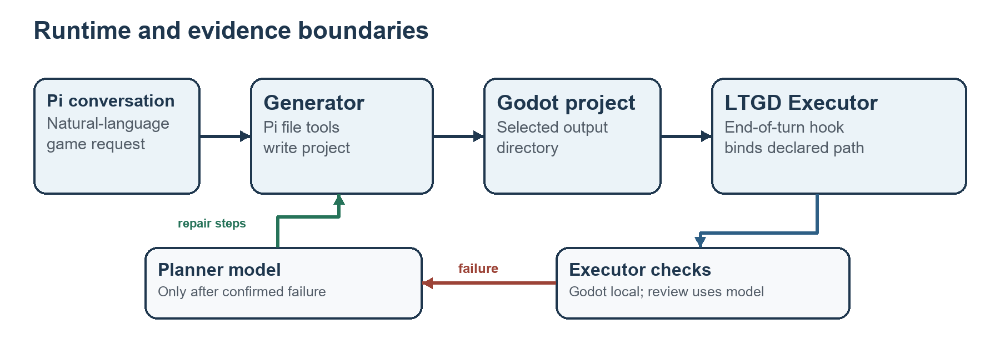

# Token Efficient Godot Game Generation with Failure Triggered Planning

Technical report | Implementation and local evidence as of 30 September 2026

## Abstract

Planning and repeated self-review can spend model tokens before a generated Godot game has been tested. The Low-Token Game Development (LTGD) Agent System applies the planning-after-trial principle to a Pi coding session: the Generator first writes a project, the Executor checks it, and the Planner is called only for a verified failure or a concrete missing requirement. Godot import and startup consume no LLM tokens; the Executor's separate requirement review does consume tokens. In three archived, single-run task pairs, LTGD recorded 38.1%–50.1% fewer Total Tokens and 26.0%–41.6% lower estimated cost than direct Pi sessions. Across the pairs, the reduction was largest in cached-context tokens, alongside fewer calls and output tokens. Twelve system implementation tests passed, and five of six archived projects passed a fresh engine smoke check. The usage sessions preceded the current implementation and have no matched gameplay score; they show an efficiency pattern, not a causal or quality result.

## 1 Token Cost Problem and Scope

A game-building agent may spend several turns planning, inspecting its own work, and replaying a growing conversation before it has a testable project. Each additional model call generates output and can resend a large cached prompt. The efficiency question is therefore when a planning call is worth paying for. PaT [1] answers this for function-level code generation by trying generation and execution first, then planning when trials fail. LTGD uses the same scheduling idea for a Godot project, with an engine check and a source-based requirement review as its failure signals. LTGD does not implement PaT's Best-of-N search, recursive subproblem decomposition, or heterogeneous model pairing.

The user's natural-language request stays in Pi. The extension is under `LTGDAgentSystem/godot-pat/`, and `LTGDAgentSystem/start.cmd` loads it through the installed `pi` command. A generated Godot game still needs a configuration file, scenes, and scripts; a chat response alone cannot establish that it starts or follows the requested player flow. LTGD checks the artifact at the end of a Generator turn so that another model planning turn is paid for only when the check identifies work to do.

The default output directory is `game/` below Pi's current directory. A user can choose another directory. The Generator ends its turn with an exact `<ltgd-project-path>...</ltgd-project-path>` handoff, and the Executor checks that directory rather than guessing a path from the request. Shared `assets/` and `Godot_Engine/` are inputs and are excluded as project roots.

The implementation contributes a failure-triggered Generator–Executor–Planner control loop, automatic Godot verification followed by requirement review, and repair plans scoped to observed evidence. The efficiency hypothesis concerns avoided model interaction; the evaluation also asks whether the generated game still meets the task.

## 2 Method and Token Accounting

Pi owns the conversation, model session, and ordinary file-editing tools. The extension supplies task state, project inspection tools, the end-of-turn hook, and the `godot-status` command. It persists task state in Pi session entries. `project.ts` indexes scenes and scripts, extracts a main scene from `project.godot`, and hashes non-cache project files. The fingerprint ties a later requirement review to the files that passed Godot. LTGD has three control roles: Generator, Executor, and Planner. Requirement Review is a model-assisted stage invoked by the Executor, not a fourth autonomous agent. Figure 1 shows the runtime boundaries; Figure 2 shows when model calls occur.

The Generator implements the original request directly. It is instructed to finish a focused first pass, avoid an open-ended self-review cycle, and give the actual output path. On `agent_before_settle`, the Executor binds that path, requires `project.godot`, and runs three ordered checks in `godot.ts`: structural presence of a scene and main scene, Godot editor import, and a 60-frame headless startup. Import is limited to 60 seconds and startup to 25 seconds. These checks use local computation rather than an LLM call. The current implementation runs Godot against the selected directory; it does not create an isolated verifier copy. Engine diagnostics are deduplicated, while the known shutdown resource message is treated as a warning.

After a Godot pass, the Executor issues a separate model request. It supplies the original goal, referenced task files, output directory, project index, and current text files. The reviewer returns one JSON status, `implemented` or `missing`, with evidence. The review rejects optional polish as a reason to continue and has a 240,000-character text limit. It also checks that the project fingerprint has not changed during review. This extra request is a token cost on every passing Godot path; reading project source may make it substantial. The review is model-based source inspection, not a recorded playtest.

### 2.1 Responsibility and handoff

| Role | Trigger and input | Action and output |
| --- | --- | --- |
| Generator | User request or focused repair steps | Uses Pi's coding tools to build and repair the selected project. A first pass avoids an upfront Planner call; each extra coding turn can expand the session context. |
| Executor | `agent_before_settle` after a Generator turn | Runs local structure, import, and startup checks without LLM tokens. On Godot PASS, it pays for a separate source-based requirement-review call and routes the result. |
| Planner | Confirmed Godot failure or concrete missing requirement | Receives the goal plus the latest failure and selected project evidence, not the Generator's full conversation. It returns JSON repair steps or a supported stop decision; it cannot edit files. |

The controller in `controller.ts` enforces the handoff: Godot `pass` leads to `review`, while `fail` leads to `plan`; a review of `implemented` leads to `done`, while `missing` leads back to `plan`. `index.ts` returns accepted repair steps to the Generator and automatically invokes the Executor after the next turn. If a repair leaves the project fingerprint unchanged, the extension stops rather than repeating the same check. Infrastructure failures, missing path handoffs, invalid project roots, oversized review input, and model-call failures also stop with a reason.

### 2.2 Example trace and intended effect

The repository's integration test supplies a concrete trace with mocked model decisions. An absent main scene fails Godot, so the Planner requests a scene repair. After the scene is added, Godot passes, but the reviewer reports that the requested scanning interaction is missing. The Planner then requests that specific repair; the Generator adds `Game.gd`, and a subsequent Godot pass plus `implemented` review reaches `done`. This test establishes the state transitions, not that a playable scanning game was produced.

A direct pass skips the Planner request, avoiding its entire prompt and output relative to a policy that always plans first. After a failure, Planner input contains the latest error and selected files rather than the Generator's full conversation. These are implemented call-routing rules.

The Generator is also told to stop after a complete first pass and to repair only confirmed failures. Fewer speculative turns would mean fewer repeated context tokens, but this prompt-level effect has not been isolated in the archived data.

At one handoff, the local Godot checks add zero model tokens. A Godot PASS adds one requirement-review call; a confirmed failure adds a Planner call and, if repair is possible, another Generator turn. Thus, relative to mandatory upfront planning, the expected avoided Planner cost grows with the share of tasks that pass the first trial. Net savings also depend on review size, failure frequency, and the length of repair turns. This is a cost-accounting argument, not an estimate from the archived logs.

The accounting also has a debit side. Every Godot PASS starts the requirement-review model call, and an actual failure adds a Planner call plus another Generator turn. A difficult task can therefore use more tokens than a direct session. LTGD currently uses the selected model for both review and planning; it has not implemented PaT's small-generator/large-planner allocation [1]. The local data below compare LTGD with direct Pi sessions, not with an always-plan baseline, so they cannot isolate the savings from skipping upfront planning.

## 3 Evaluation Procedure

The primary evaluation question is whether LTGD reduces model usage while preserving completion quality relative to direct Pi generation. Efficiency is described with calls, uncached input, cache reads and writes, output, Total Tokens, and estimated USD cost. Completion is checked at three progressively stronger levels: Godot import, headless startup, and satisfaction of the original gameplay requirements. The local archive supports only the first two artifact checks; it has no common gameplay evaluator or matched requirement score.

**Direct baseline.** Each pair has an identical first user task prompt, the same recorded working directory, `deepseek-flash` model, and Pi `high` thinking setting. Direct is the ordinary Pi session, while LTGD has extension-specific records and the LTGD control flow. Both tasks refer to the same repository-relative engine and asset paths. The logs do not prove identical file snapshots, Pi versions, loaded extensions beyond the LTGD record, sampling parameters, or budgets; the runs were sequential rather than synchronized. Direct could use its normal tools and task-specified Godot checks. These conditions make a descriptive pair, not a fully controlled baseline.

This report uses two kinds of local evidence. First, `LTGDAgentSystem/tests/godot-pat.test.ts` exercises controller transitions, path handoff, Planner and reviewer inputs, state restoration, real Godot import and startup, and CMD launcher loading. It was run on Windows with Node 24.19.0, the installed Pi package dependencies, and the local Godot 4.6.2 Windows console executable; the installed Pi command reported version 0.87.1 when this report was revised. The source-code baseline for this report was commit `2547085`; this is not a recorded revision identifier for the older usage sessions. Second, each archived game under `output/game/` was copied to a temporary directory without `.godot` cache data and passed through the current `verifyProject` function on 30 September 2026. This copy isolates the report's recheck from the archived project; it is a procedure used for this report, not a feature of the extension.

The archived usage exports in `output/token_usage/` are a separate historical observation: one Pi session per task and condition, all using `deepseek-flash`. The sessions predate the latest path-handoff implementation and were not randomized or replicated. We compare calls, uncached input, cache reads, output, Total Tokens, and estimated USD cost. Total Tokens equal uncached input plus cache read, cache write, and output; cache write was zero in all six exports. Reasoning tokens are already included in output.

Cached tokens are counted in Total Tokens but have a different price from uncached tokens, so token and cost percentage changes need not match. The six logs do not label each call by LTGD role, which prevents a measured per-role attribution.

## 4 Results

### 4.1 System correctness and artifact validity

| Check | Observation | Evidence boundary |
| --- | --- | --- |
| System implementation tests | 12 passed, 0 failed | Includes mocked model decisions and one real Godot smoke test; no gameplay score. |
| Archived project recheck | HSL direct, HSL LTGD, MAG LTGD, PIB direct, and PIB LTGD passed import and headless startup | Fresh check of copied snapshots on 30 September 2026. |
| MAG direct snapshot | `project.godot` absent at `output/game/MAG_direct` | No valid Godot project root was available for that snapshot. |

The five passing projects produced no blocking Godot diagnostic in this recheck. This says the engine could import and start their main scenes for the bounded check. It does not show that menus, controls, win conditions, visuals, or audio met their respective task instructions.

### 4.2 Historical token usage

Table 1. Provider-reported usage for one archived run per task and condition. Input excludes cache reads. All token columns are counts; cache write was zero in every run. PIB is the archive identifier for Ivory Beats.

| Game | Run | Calls | Input | Cache read | Output | Total Tokens | Cost USD |
| --- | --- | ---: | ---: | ---: | ---: | ---: | ---: |
| Horror Signal Lost | Direct | 171 | 87,971 | 32,561,280 | 242,006 | 32,891,257 | 0.512166 |
| Horror Signal Lost | LTGD | 123 | 59,456 | 16,192,256 | 153,278 | 16,404,990 | 0.298924 |
| Puzzle Magnet Lab | Direct | 174 | 81,739 | 34,328,704 | 239,879 | 34,650,322 | 0.518349 |
| Puzzle Magnet Lab | LTGD | 138 | 54,618 | 19,223,040 | 188,248 | 19,465,906 | 0.357621 |
| Ivory Beats (PIB) | Direct | 73 | 53,366 | 8,084,992 | 129,873 | 8,268,231 | 0.220367 |
| Ivory Beats (PIB) | LTGD | 53 | 39,574 | 4,980,736 | 101,126 | 5,121,436 | 0.163108 |

Table 2. Percentage reduction in LTGD relative to the direct run of the same task; positive values mean lower recorded use in LTGD.

| Game | Calls | Uncached input | Cache read | Output | Total Tokens | Cost USD |
| --- | ---: | ---: | ---: | ---: | ---: | ---: |
| Horror Signal Lost | 28.1% | 32.4% | 50.3% | 36.7% | 50.1% | 41.6% |
| Puzzle Magnet Lab | 20.7% | 33.2% | 44.0% | 21.5% | 43.8% | 31.0% |
| Ivory Beats | 27.4% | 25.8% | 38.4% | 22.1% | 38.1% | 26.0% |

The six rows in Table 1 come from `output/token_usage/{HSL,MAG,PIB}_{direct,LTGD}/usage.json`, including both PIB records. Across the three pairs, the counts sum to 418 versus 314 calls, 75.81 million versus 40.99 million Total Tokens, and USD 1.251 versus 0.820 for Direct versus LTGD. These sums describe the three archived tasks, not an expected saving on a new task. Cache reads account for most counted tokens and had the largest aggregate reduction (46.1%); output tokens fell 27.6%, uncached input fell 31.1%, and estimated cost fell 34.5%. The simultaneous decline in calls and cache reads is consistent with shorter sessions that replayed less accumulated context. The aggregate export cannot show whether this came from failure-triggered planning, different generated actions, task variance, or the earlier controller revision.

## 5 Limitations

Godot import and a 60-frame headless run are narrow technical checks. They may miss input handling, later scene transitions, presentation faults, and features that require interaction. The separate reviewer reads source and task text but cannot see the rendered game or reliably prove the player experience. A positive review can therefore overstate completeness.

The Generator's explicit path handoff is a useful contract but also a failure point: a missing or wrong tag stops the task, and the extension does not search for a likely alternative. Project hashing excludes cache directories and symbolic links; it detects ordinary project-file changes, but it is not a full artifact provenance system. The 240,000-character review limit stops large projects rather than silently reviewing a partial source set.

The current `start.cmd` and tests target Windows and a local Godot 4.6.2 console executable. The available game outputs and usage sessions are development artifacts, not a controlled benchmark. No repeated trials, always-plan ablation, per-role token trace, blinded playtest, or common visual assessment were available. The Direct MAG snapshot lacks `project.godot`, so even startup success is not matched across that pair. The observed cost difference cannot be attributed to the current extension or interpreted as equal-quality savings. A decisive evaluation would hold the task, model, budget, and acceptance test fixed; repeat Direct, always-plan, and LTGD runs; and report tokens, cost, completed gameplay, and the fraction that reached Planner.

## 6 Conclusion

LTGD's contribution is a concrete token-allocation policy for game generation: let the Generator produce a first testable candidate, use local Godot execution to decide whether it is technically viable, and invoke the Planner only for observed failures or missing requirements. The Executor's review protects the original task boundary but adds a model call, making the net token result empirical rather than automatic. Twelve tests support the implemented routing. Three earlier task pairs recorded 38.1%–50.1% fewer Total Tokens and 26.0%–41.6% lower estimated cost for LTGD, with much of the counted reduction in repeated cached context. The strongest supported conclusion is that LTGD implements and exercises a failure-triggered verification and repair workflow; whether it improves completed gameplay or reproducibly reduces cost remains unmeasured.

## References and Source Basis

[1] Yoon et al. "PaT Planning-after-Trial for Efficient Test-Time Code Generation." ACL 2026. https://aclanthology.org/2026.acl-long.1703/ . The comparison here concerns its trial-first scheduling principle; the paper's reported benchmark performance and heterogeneous-model cost results are not LTGD measurements.

Local sources: `LTGDAgentSystem/godot-pat/{index,controller,godot,executor,planner,project}.ts`, `LTGDAgentSystem/tests/godot-pat.test.ts`, `output/game/`, and `output/token_usage/`.
